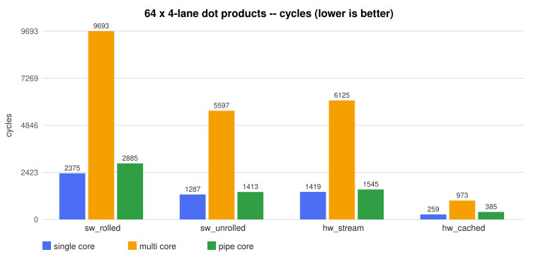
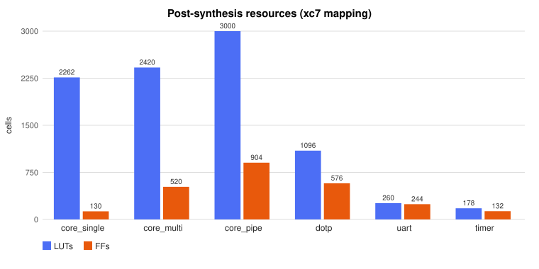
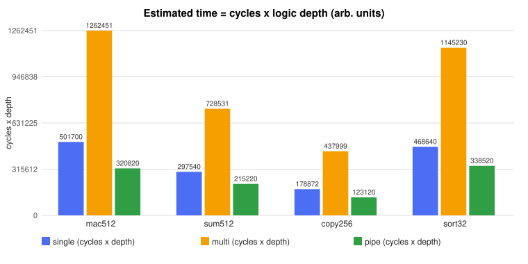
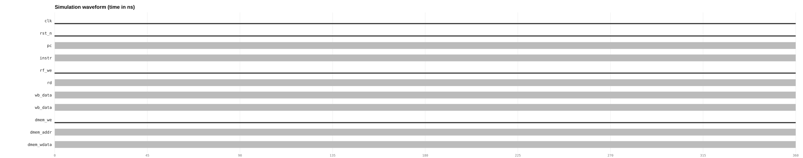
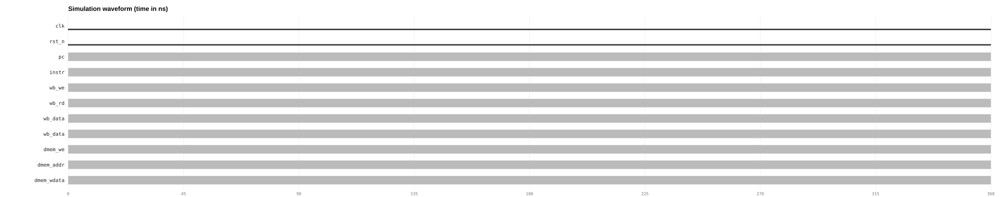

[](https://doi.org/10.5281/zenodo.22917001)
# custom-riscv

A 32-bit RISC-V computer built from scratch in SystemVerilog, three times:
a **single-cycle** core, a **multi-cycle** core and a **5-stage pipelined**
core with forwarding -- all on one system-on-chip with instruction/data
memories, a UART serial port, a timer with interrupts, and a custom
**dot-product instruction** (`CDOT`) that I designed myself.

Everything in this repo is executable and measured: 29 automated self-checking
tests, self-timing benchmarks driven by the hardware timer, and Yosys
synthesis reports. The full story (including the bugs and the negative
results) is in [docs/REPORT.md](docs/REPORT.md).


## What's inside

* **Cores** (`rtl/core/`) -- RV32I subset + `MUL` + `CDOT` + `MRET`.
  Single-cycle, multi-cycle (FSM), and pipelined with full forwarding and
  drain-based precise interrupts.
* **SoC** (`rtl/soc/`) -- bus, address decode, 1K-word instruction and data
  memories, UART (8N1), timer with interrupt, dot-product unit, and a
  simulation exit port.
* **Custom instruction** (`rtl/custom/dotp.sv`) -- 4-lane dot product in one
  instruction: `rd = A0*B0 + A1*B1 + A2*B2 + A3*B3`. Measured **5.0x**
  faster than unrolled software (9.2x over the natural loop) when the vectors
  are staged in the unit's local registers -- and honestly *slower* than good
  software when they are streamed one at a time (report, section 5).
* **Tooling** (`tools/`) -- my own two-pass assembler, a 29-test regression
  runner, a benchmark harness, a Yosys driver, and chart/waveform renderers.
  No downloaded cores and no black-box IP.

## Headline results (all measured, see report)

**64 dot products of 4-lane vectors, cycles (lower is better):**

| path | single | multi | pipe |
|------|-------:|------:|-----:|
| software, rolled loop | 2375 | 9693 | 2885 |
| software, unrolled | 1287 | 5597 | 1413 |
| CDOT, streamed | 1419 | 6125 | 1545 |
| **CDOT, cached** | **259** | **973** | **385** |



**Synthesis (Yosys, xc7-style mapping, memories black-boxed at SoC level, regfile = 24x RAM32M LUTRAM):**

| top | LUTs | FFs | RAM | DSP48E1 | logic depth |
|-----------|-----:|-----:|----:|--------:|------------:|
| soc_single | 3844 | 1148 | 24 | 30 | 116 |
| soc_multi | 4050 | 1538 | 24 | 30 | 71 |
| soc_pipe | 4072 | 1922 | 24 | 30 | 60 |



**The architecture punchline:** the pipelined core is not the lowest-cycle
design (taken branches cost flushes; its CPI is 1.1-1.5 vs 1.0), but its
critical path is 40% shorter, so in estimated time it wins by 1.3-1.6x. The
multi-cycle core's CPI near 4 buries its shorter clock. More in the report.



**Waveforms** -- the same `test_basic` fetch/decode on the single-cycle core,
and the dot-product hazard on the pipelined core (custom unit data forward):





Datapaths: [single-cycle](diagrams/datapath_single.svg) --
[pipelined](diagrams/pipeline.svg) -- [CDOT unit](diagrams/dotp.svg)

## Getting started

Needs Python 3, Icarus Verilog and Yosys. Full Windows setup guide:
[docs/setup.md](docs/setup.md).

```sh
make test        # 29-test regression (unit + 3 cores x 6 programs)
make bench       # self-timing benchmarks -> benchmarks/results.json
make synth       # Yosys -> synthesis/reports/summary.json
make figures     # redraw every chart from the JSONs
make wave        # dump + render example waveforms
```

Run a program by hand:

```sh
python3 tools/asm.py programs/asm/hello.s -o build/hello --list build/hello.lst
make -s build/tb_soc_single.vvp
vvp build/tb_soc_single.vvp +HEX=build/hello_prog.hex +DATA=build/hello_data.hex
```

Every testbench is self-checking (`=== tb_soc_X PASSED ===`) and programs use
the same exit convention in simulation.

## Reproducing the report numbers

The report's tables come from exactly two files:

* `benchmarks/results.json` -- produced by `python3 tools/run_bench.py`
* `synthesis/reports/summary.json` -- produced by `python3 tools/run_synth.py`

`tools/make_charts.py` redraws all figures from those files, so the pictures
cannot drift from the data. Test cycles are printed by
`python3 tools/run_tests.py`.

## Memory map

| base | device |
|------|--------|
| `0x0000_0000` | instruction memory (1K words) |
| `0x1000_0000` | data RAM (1K words) |
| `0x2000_0000` | UART (DATA / STATUS / RXDATA) |
| `0x3000_0000` | timer (CNT / CMP / CTRL, interrupt on CMP) |
| `0x4000_0000` | dot-product unit (A0-A3, B0-B3, RESULT, CMD) |
| `0x5000_0000` | simulation exit (testbench only) |

Interrupt vector at `0x0000_0004`; `MRET` returns via EPC.

## Repository layout

```
rtl/         core, memory, peripherals, custom unit, SoCs (SystemVerilog)
testbench/   11 unit testbenches + 3 SoC testbenches (self-checking)
programs/asm test programs + benchmarks (assembly)
tools/       assembler, regression, benchmarks, synthesis, figure renderers
synthesis/   Yosys reports and summaries
benchmarks/  results.json + figures
waveforms/   rendered timing diagrams
diagrams/    architecture SVGs
docs/        technical report + setup guide
```

## Honest caveats

* Everything is **simulation and synthesis** -- no FPGA board, no silicon.
* Timing numbers are gate-depth estimates, not sign-off STA (report, sec. 6).
* The ISA subset is word-oriented (no byte loads/stores) -- see report appendix.

## Credits

Built entirely by me - all SystemVerilog RTL, assembly programs, Python tools (assembler, test runner, bench harness, synthesis driver, chart and waveform renderers), diagrams, waveforms, and docs are my own work. No downloaded CPU cores, no black-box IP, no team.

License: MIT (see [LICENSE](LICENSE)).
