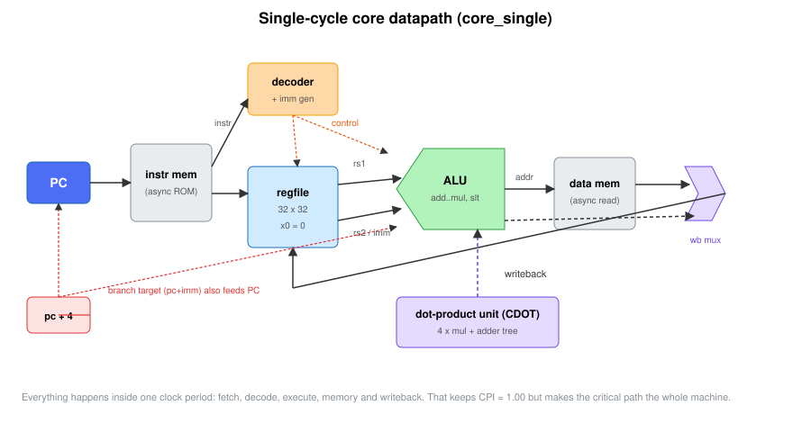
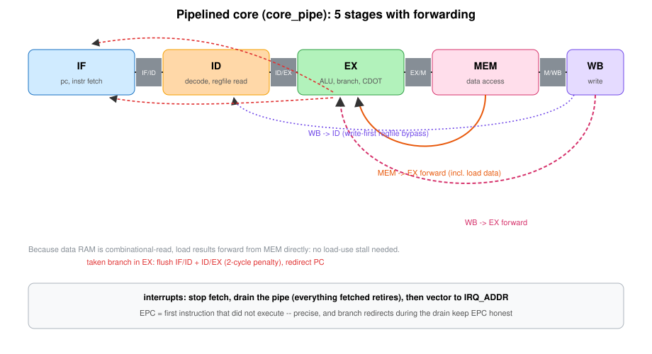
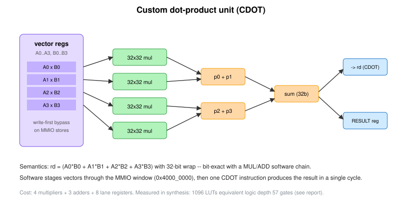
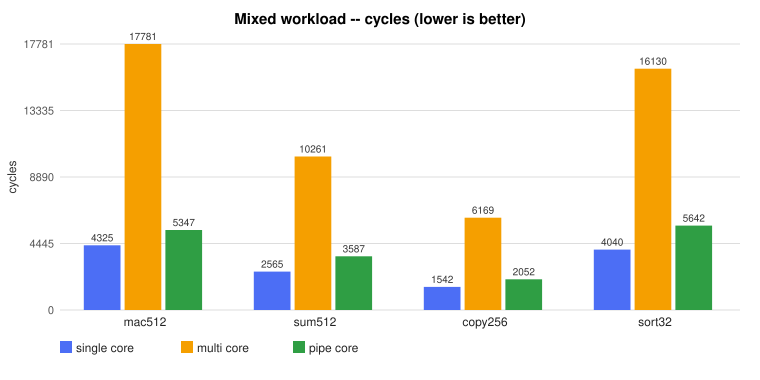

# A 32-bit RISC-V Computer, Three Ways

**Building and comparing single-cycle, multi-cycle and pipelined processors with a
custom dot-product instruction**

*All RTL, assembly, tools, diagrams, and docs in this repo are my own work - see AUTHORS file.*

---

## 1. Abstract

I designed and built a small computer from scratch in SystemVerilog. At its core
is a 32-bit RISC-V processor (RV32I plus MUL, a custom instruction and a
minimal trap return). I implemented that processor three times, as three
genuine microarchitectures: a single-cycle core, a multi-cycle core and a
5-stage pipelined core with forwarding. Each core sits on the same system bus
with 1K-word instruction and data memories, a UART serial port, a hardware
timer with interrupts, and a custom dot-product coprocessor that I designed and
exposed through a custom-0 instruction (`CDOT`) plus a memory-mapped window.
Everything is verified by 29 self-checking automated tests (unit testbenches
with random stress, and six assembly programs run on all three cores),
benchmarked with programs that time themselves using the hardware timer, and
synthesized with Yosys to a Xilinx 7-series style mapping for resource counts
and to generic gates for logic-depth analysis. The custom instruction computes
a 4-lane dot product in one instruction and runs that operation 5.0x faster
than unrolled software on the same core (9.2x over the natural software loop),
at a cost of about 1.1k LUTs of extra logic. The architectural comparison is
the interesting part: in raw cycles the pipelined core looks *slower* than the
single-cycle core (its branches cost flushes), but its critical path is 40%
shorter, and when I combine the measured cycle counts with the measured logic
depths the pipelined design is 1.3-1.6x faster in estimated time while the
multi-cycle design loses badly on its 4-cycle average CPI.

## 2. Motivation

Most people who program computers never see below the level of the C language.
I wanted to build the thing that runs the program instead. A soft processor
core is a nice project because it sits exactly on the line between computer
science and electrical engineering: every instruction-set rule has to become a
circuit, and every circuit choice shows up later as benchmark numbers.

I picked RISC-V because the instruction set is small enough to learn properly
and open enough that tooling exists. I picked a custom instruction as the
"research" angle because just implementing an ISA is engineering; measuring
whether specialized hardware actually pays for itself is an experiment. And I
built three microarchitectures rather than one because a single design cannot
answer the only question that matters in computer architecture: *what did the
extra complexity buy?*

Everything here is simulation and synthesis. I do not have an FPGA board and I
did not fabricate anything. The claim is narrower and, I think, more honest:
this is real RTL, it really executes programs in simulation, and it really
synthesizes to logic cells that I counted.

## 3. Architecture

### 3.1 System overview

The processor is the center of a small system-on-chip. Fetch accesses go to a
dedicated instruction memory (a Harvard split at the top level keeps the
single-cycle core single-cycle); loads and stores travel on a system bus with
one-hot address decoding on `addr[31:28]`.


| Region | Base | Device | Registers |
|--------|------|--------|-----------|
| `0x1` | `0x1000_0000` | data RAM | 1K x 32 words |
| `0x2` | `0x2000_0000` | UART | DATA, STATUS, RXDATA |
| `0x3` | `0x3000_0000` | timer | CNT, CMP, CTRL |
| `0x4` | `0x4000_0000` | dot-product unit | A0-A3, B0-B3, RESULT, CMD |
| `0x5` | `0x5000_0000` | sim exit | write ends simulation (testbench hook) |

The timer's CNT register is a free-running cycle counter that software can
read and write. That is how every benchmark number in this report was
measured: the benchmark program reads the counter before and after a kernel and
prints the difference over the UART. The numbers come from the hardware
perspective of the program being measured, not from a script guessing.

### 3.2 Instruction set

The implemented subset is RV32I minus FENCE/ECALL and minus byte/halfword
memory access (the bus is word-oriented), plus:

* `MUL rd, rs1, rs2` (the one piece of the M extension; funct7 `0000001`),
* `CDOT rd` (my custom instruction, in the RISC-V custom-0 opcode space),
* `MRET` (return from the timer interrupt).

Full list in Appendix A. Everything else that matters for real programs is
there: all the ALU and immediate forms, `LUI`/`AUIPC`, all six conditional
branches, `JAL`/`JALR`, `LW`/`SW`, and the `x0`-is-zero rule enforced in the
register file.

### 3.3 The three cores

All three cores speak to the same memory and peripheral interfaces and execute
the same programs. They differ only in how work is scheduled in time.

**core_single** does everything in one clock period: fetch, decode, register
read, ALU, memory access and writeback are one long combinational chain from
register edge to register edge. CPI is exactly 1.000 by construction (the
retire counter confirms cycle count equals instruction count to within the exit
store). The cost is that the clock period must cover the entire machine.



**core_multi** runs one instruction at a time through an FSM
(IF -> ID -> EX -> [MEM] -> [WB]), 3-5 cycles per instruction depending on the
class. It is the "textbook basic" processor. Because only one stage is active
per cycle, the same adder serves every step and the hardware is compact, but
CPI lands around 4.

**core_pipe** is the 5-stage pipeline. One instruction enters every stage every
cycle, with full forwarding (MEM->EX and WB->EX paths plus a write-first
register file for the WB->ID case). Two design points are worth calling out:

1. *No load-use stall.* My data memory reads combinationally, so a load's data
   is already available during its MEM stage and can be forwarded to the next
   instruction's EX stage. The classic load-use interlock is simply not needed
   with this memory model. (This is a real trade: the memory read joins the
   critical path of the MEM stage instead of being hidden behind a stall.)
2. *Drain-based interrupts.* When the timer raises its interrupt, the fetch
   stage stops and the pipeline drains: everything already fetched retires,
   then we vector to `0x0000_0004` with EPC pointing at the first instruction
   that did *not* execute. Branch redirects that occur during the drain update
   the held PC, so EPC stays precise even then. It costs a few cycles of
   latency and almost no logic.



Interrupt handling differs per core in a way that I think is instructive:
the single-cycle core squashes the instruction currently on the bus and re-runs
it after `MRET` (nothing has committed yet, so it is precise for free); the
multi-cycle core simply samples interrupts in its IF state (even easier: one
instruction in flight); the pipelined core pays the drain cost because five
instructions are in flight. Same architectural behavior, three different
prices.

### 3.4 Peripherals

**UART** is 8N1 with a programmable divisor (4 clocks per bit in simulation,
fast; 868 would give 115200 baud at 100 MHz). Three registers: DATA (write to
send, software polls STATUS.tx_busy first), STATUS (tx busy, rx available),
RXDATA (reading it clears rx-available). A transmitter and receiver are both
implemented and the receiver is verified through an actual loopback wire in
simulation, not by poking internal signals.

**Timer** has a free-running 32-bit counter, a compare register and a control
register with an interrupt-enable bit and a write-1-to-clear pending bit. On a
match the pending bit sets; the irq output is pending AND enable. Periodic
operation is done in software by advancing CMP in the handler, which is how
real timer drivers work.

### 3.5 Custom dot-product unit



The unit holds two 4-lane vectors (A0-A3, B0-B3) in its own tiny register
file. Software stores lanes through the memory-mapped window at `0x4000_0000`,
then either executes `CDOT rd` (the result appears in `rd`, computed in the
core's EX stage in a single cycle on all three cores) or writes CMD and reads
RESULT (so the unit is usable even without the ISA hook).

Semantics: `rd = A0*B0 + A1*B1 + A2*B2 + A3*B3`, all 32-bit wrapping
arithmetic. I chose wrapping on purpose: it is bit-identical to what a chain of
`MUL` + `ADD` instructions computes (mod 2^32 the truncated products sum to the
truncated sum), so the custom instruction cannot disagree with the software
reference. The testbench checks exactly this against a 64-bit-accumulating
reference on 500 random vector pairs.

The microarchitecture is four 32x32 multipliers and a two-level adder tree, in
combinational logic, with a write-first bypass on the lane registers. That
bypass is not a nicety: the pipelined core can have the last vector store in
MEM while `CDOT` is already in EX, and without the bypass `CDOT` would compute
with the old lane. I know because my hazard test caught exactly that bug.

## 4. Implementation

### 4.1 Tooling and structure

Everything is SystemVerilog-2012 kept inside a subset that both Icarus Verilog
(12.0) and Yosys (0.52) accept. The repository layout:

```
rtl/basic/     gates, mux, register, counter (the pieces I started from)
rtl/core/      alu, regfile, imm_gen, decoder, core_single/multi/pipe
rtl/mem/       imem, dmem
rtl/periph/    uart_tx, uart_rx, uart, timer
rtl/custom/    dotp
rtl/soc/       soc_single/multi/pipe
testbench/     11 unit testbenches + 3 SoC testbenches
programs/asm/  6 test programs + 2 benchmarks (assembly)
tools/         assembler, regression runner, benchmark harness, synthesis
               driver, chart and waveform renderers
synthesis/     yosys reports
benchmarks/    results.json + figures
docs/          this report, setup guide
diagrams/      architecture figures
```

I wrote my own two-pass assembler (`tools/asm.py`) for the subset. It knows the
ABI register names, the usual pseudo-instructions (`li`, `la`, `call`, `ret`,
`beqz`, `bgt`, ...), `.text`/`.data` sections mapped onto the two memories, and
it produces listing files. Writing the encoder by hand was the fastest way to
make sure I actually understood every instruction format; the B-type and
J-type immediate fields are scrambled for a reason (short sign bits), and two
of my unit-test vectors for `imm_gen` were wrong before my own assembler
corrected me.

### 4.2 The building blocks

The ALU is a case statement over 11 operations (ADD, SUB, SLL, SLT, SLTU, XOR,
SRL, SRA, OR, AND, MUL) with the comparators shared with the branch unit. The
register file is 32x32 with two combinational read ports, one write port, and
x0 tied to zero (reads forced, writes dropped). The decoder is purely
combinational and shared by all three cores. Keeping the decoder honest meant
one source of truth for control signals no matter the scheduling.

The single-cycle core is the purest datapath; the multi-cycle core wraps the
same datapath in a 5-state FSM and keeps its PC pointing at the current
instruction until it retires (the "next PC" is decided at EX and latched, and
whichever state retires the instruction loads it); the pipelined core is the
one with real hazard engineering in it (forwarding priority: nearest producer
wins, MEM stage over WB stage).

### 4.3 Bugs I am glad I hit

Three debugging stories belong in this report because each one taught me
something that no tutorial would have:

1. **The combinational bypass loop.** The pipelined core needs the write-first
   register-file bypass (an instruction in ID must see a result retiring in
   WB). I used the same register file in the single-cycle core and simulation
   simply hung with no waveform activity anywhere. The bypass creates a
   combinational loop there: read data -> ALU -> writeback -> read data, all in
   one cycle, all for the *same* instruction. The fix was a `BYPASS` parameter
   that the single-cycle core sets to zero. Combinational loops do not fail
   politely; they just eat the scheduler.

2. **The `jal` clobbering `ra`.** My print-string routine called the
   print-character routine with `jal ra, ...`, and then the outer routine's
   `ret` jumped back into its own loop. A nested call destroys the caller's
   link register unless you save it. I added a real stack pointer and stack
   frames to the print routines after that. Embarrassing, extremely
   educational.

3. **The store/CDOT race.** The hazard test runs `CDOT` one instruction after
   the last vector store. On the pipelined core the store is in MEM while CDOT
   is in EX, so the combinational dot product was reading the old lane value.
   The single-cycle and multi-cycle cores passed, which is how I knew it was a
   pipeline-timing issue. The fix is the write-first bypass inside the dotp
   unit itself, the same pattern as the register file. This is a real class of
   bug in any design with memory-mapped accelerator registers.

### 4.4 Verification strategy

Every testbench is self-checking and prints a single machine-readable verdict
line that `tools/run_tests.py` greps. Random tests use independent reference
models (the ALU's SRA reference is built from explicit sign-bit replication
rather than `>>>`, so the test does not just mirror the implementation).

* ALU: directed corners for every operation + 5000 random vectors.
* Register file: x0 semantics, write-first bypass check, 2000 random ops
  against a shadow model.
* imm_gen / decoder: known encodings for every format and class.
* UART: real loopback through the serial pin at 4 clocks per bit, framing error
  detection included.
* Timer: counting, compare, enable gating, write-1-to-clear.
* dotp: 500 random vector pairs against a 64-bit reference, both the custom
  instruction path and the MMIO path, plus the same-cycle bypass case.
* Six assembly programs (ALU/branch/jump checks, memory checks, UART printing,
  timer interrupt with a real handler that saves registers and reschedules,
  CDOT vs software cross-checks, and a dependency/flush stress test), each run
  on all three cores.

Current status: 29/29.

## 5. Custom instruction: design and evaluation

### 5.1 Encoding

`CDOT rd` sits in the custom-0 opcode (`0001011`) with funct3 `000`. rs1 and
rs2 are reserved for a future extension (for example, selecting one of several
vector banks) and must be written as zero. The decoder recognizes it and the
result travels the normal ALU writeback path (the unit's output muxes over the
ALU result in EX), which means forwarding, writeback and the register file need
no special cases at all.

### 5.2 What it competes against

I benchmarked four ways to compute 64 dot products of 4-lane vectors
(`programs/asm/bench_dot.s`), all timed by the hardware timer, all cross-checked
to produce the same accumulated value:

* **sw_rolled** -- the natural software loop: per lane `lw, lw, mul, add` plus
  pointer updates and a loop branch.
* **sw_unrolled** -- the best plain-software version: 8 loads, 4 multiplies, 3
  adds per dot product.
* **hw_stream** -- stage both vectors into the unit through the MMIO window
  (8 stores) then `CDOT`, for every dot product.
* **hw_cached** -- stage the vectors once, then `CDOT` 64 times.

### 5.3 Results (cycles for 64 dot products)

| path | single-cycle | multi-cycle | pipelined | per dot (single) |
|------|-------------:|------------:|----------:|-----------------:|
| sw_rolled | 2375 | 9693 | 2885 | 37.1 |
| sw_unrolled | 1287 | 5597 | 1413 | 20.1 |
| hw_stream | 1419 | 6125 | 1545 | 22.2 |
| hw_cached | **259** | **973** | **385** | **4.0** |


Speedups of the cached custom path on the single-cycle core: **9.2x** over the
rolled loop, **5.0x** over unrolled software, **5.5x** over the streaming
custom path. The ratios hold across all three cores (5.7x over unrolled on the
multi-cycle core, 3.7x on the pipelined core).

### 5.4 The honest negative result

`hw_stream` is *slower* than `hw_unrolled` on every core (about 1.10x worse).
This is the most useful number in the whole project. Staging eight 32-bit words
through the bus costs more than the four multiplies it saves, so the custom
instruction only wins when the vectors live in the unit's local register file
across many dot products. That is not a contrived scenario -- anything with a
fixed operand (a filter kernel, a cluster centroid, a projection axis) looks
like `hw_cached` -- but it does mean the unit is an accelerator for a
*dataflow*, not a magic speedup for a single operation. A CDOT variant with an
auto-indexed vector load (a DMA-style fetch of 4 words per operand) would close
the streaming gap; I left it as future work rather than half-build it.

## 6. Experimental methodology

**Cycle measurement.** Benchmarks bracket their kernels with reads of the
timer's CNT register and print `BENCH <name> 0x<cycles>` over the UART. The
harness (`tools/run_bench.py`) parses those lines into
`benchmarks/results.json`. No number in this report is typed in by hand; every
one is in that file or in `synthesis/reports/summary.json` and can be
regenerated with two commands.

**Instruction counts and CPI.** The single-cycle core executes exactly one
instruction per cycle (confirmed by its retire counter: cycles = instrs + 1 for
every compute-bound program). Its cycle counts are therefore *also* measured
dynamic instruction counts, which I use as the denominator for CPI of the other
two cores on the same kernels. Test programs that poll (the timer and UART
tests) execute a different number of poll-loop iterations per core, and I keep
them out of the CPI argument.

**Synthesis.** `tools/run_synth.py` runs two flows per top with Yosys 0.52:
(a) `synth_xilinx -family xc7` for resource counts (LUTs, FFs, carry cells,
DSP48E1s, distributed RAM) and (b) generic `synth` + `ltp` (longest
topological path) on the flattened netlist for logic depth. Memories get their
own runs and are black boxes inside the SoC runs: a fixed-content ROM
constant-folds the whole design into nothing (I watched a 7k-LUT SoC shrink to
351 cells before I understood why), and in any real system these arrays map to
block RAM or distributed RAM rather than to LUT logic. The SoC numbers below
exclude the two 1Kx32 memory arrays and say so.

**Timing model.** I have no place-and-route and no static timing analyzer in
this flow, so I do not report MHz as a measured fact. Instead I use gate-level
logic depth as a delay proxy and I say exactly that. The memory access itself
adds depth: the data RAM alone measures 10 gate levels. So my clock-period
model is `Tclk ~ D_logic + M` per stage, where the single-cycle core pays the
full chain plus both memory reads (its path really is
fetch-mem -> decode -> regfile -> ALU -> data-mem -> writeback), while the
other cores pay at most one memory read per stage. Adjusted depths:
single 116-2+2x10 = **134**, multi 71-1+10 = **80**, pipe 60-1+10 = **69**
gate levels. Relative clock periods 1.00 : 0.60 : 0.51, or relative Fmax
**1.00 : 1.68 : 1.94**. Estimated time for a workload is `cycles x depth`.
This model ignores interconnect and register clock-to-Q; treat it as a
comparison, not a datasheet.

## 7. Results

### 7.1 Correctness

29/29 automated tests pass: 11 unit testbenches (including 7000+ randomized
vectors with independent reference models) and 6 programs on 3 cores.

### 7.2 Program cycles and CPI

| test program | single cyc / instr | multi cyc | multi CPI | pipe cyc | pipe CPI |
|--------------|-------------------:|----------:|----------:|---------:|---------:|
| test_basic | 169 / 168 | 633 | 3.84 | 198 | 1.21 |
| test_mem | 254 / 253 | 972 | 3.89 | 319 | 1.28 |
| test_hello | 1718 / 1717 | 2733 | -- | 1838 | -- |
| test_timer | 874 / 869 | 1087 | -- | 917 | -- |
| test_dot | 116 / 115 | 469 | 4.19 | 127 | 1.14 |
| test_hazard | 146 / 145 | 551 | 3.88 | 189 | 1.34 |

(test_hello and test_timer are paced by UART polling and timer interrupts, so
their instruction counts differ per core; no CPI claim for them.)

Benchmark kernels, CPI from the instruction counts above:

| kernel | instrs | multi CPI | pipe CPI |
|--------|-------:|----------:|---------:|
| mac512 | 4325 | 4.11 | 1.24 |
| sum512 | 2565 | 4.00 | 1.40 |
| copy256 | 1542 | 4.00 | 1.33 |
| sort32 | 4040 | 3.99 | 1.40 |
| dot sw_rolled | 2375 | 4.08 | 1.21 |
| dot hw_cached | 259 | 3.76 | 1.49 |

The multi-cycle core sits at CPI 3.8-4.2 exactly as its FSM predicts (4 cycles
for ALU ops, 5 for loads, 3 for branches). The pipelined core runs CPI
1.14-1.49: the spread is almost entirely branch frequency. `test_dot` at 1.14
is straight-line code; `sort32` at 1.40 is a bubble sort where almost every
instruction is a loop branch and each taken branch flushes two younger
instructions. That is the cost of resolving branches in EX.

### 7.3 Mixed workload (cycles)

| kernel | single | multi | pipe |
|--------|-------:|------:|-----:|
| mac512 (512 multiply-accumulates) | 4325 | 17781 | 5347 |
| sum512 (512 loads + adds) | 2565 | 10261 | 3587 |
| copy256 (256 load/store pairs) | 1542 | 6169 | 2052 |
| sort32 (bubble sort, 32 words) | 4040 | 16130 | 5642 |



Read as cycles alone, the single-cycle core "wins" every row. That reading is
wrong, and the next section is about why.

### 7.4 Synthesis

Xilinx 7-series style mapping (Yosys `synth_xilinx -family xc7`), flattened,
memories black-boxed at SoC level, multiplier cells shown as DSP48E1s,
register file shown as LUTRAM:

| top | LUTs | FFs | CARRY4 | RAM | DSP48E1 | logic depth |
|-----------|-----:|-----:|-------:|----:|--------:|------------:|
| core_single | 2262 | 130 | 92 | 24 | 6 | 59 |
| core_multi | 2420 | 520 | 92 | 24 | 6 | 59 |
| core_pipe | 3000 | 904 | 108 | 24 | 6 | 52 |
| dotp (custom unit) | 1096 | 576 | 16 | 0 | 24 | 57 |
| uart | 260 | 244 | 36 | 0 | 0 | 13 |
| timer | 178 | 132 | 16 | 0 | 0 | 11 |
| dmem (1Kx32) | 72 | 0 | 0 | 256 | 0 | 10 |
| soc_single | 3844 | 1148 | 160 | 24 | 30 | **116** |
| soc_multi | 4050 | 1538 | 160 | 24 | 30 | **71** |
| soc_pipe | 4072 | 1922 | 176 | 24 | 30 | **60** |

RAM is distributed LUTRAM: 24x RAM32M for the 32x32 register file (2 read
ports, 1 write port maps to 24 of those primitives), 256x RAM256X1S for the
1Kx32 data memory.


Observations, all from the table:

* The pipelined core costs 33% more LUTs and 7x the flip-flops of the
  single-cycle core (pipeline registers are not free) and shortens the SoC
  logic depth from 116 to 60.
* The multi-cycle core is nearly the single-cycle core's LUT count (the FSM
  control is small) but needs 4x the flip-flops to hold the instruction and its
  operands between stages.
* The custom unit is 1096 LUTs + 24 DSP cells -- about 28% on top of the
  single-cycle core's LUT count, or 11% of the SoC. The four multipliers are
  where the DSPs go; in pure LUTs a 32x32 multiplier would have cost far more.
* The data RAM (1Kx32 = 32 Kbit) maps to 256 distributed RAM primitives with a
  10-level read path. The instruction memory is structurally identical (it
  constant-folds standalone and I document that instead of pretending
  otherwise).

### 7.5 Estimated time: where pipelining pays

Combining the measured cycles with the adjusted depths from the timing model
(single 134, multi 80, pipe 69 gate levels):

| kernel | single | multi | pipe | pipe vs single |
|--------|-------:|------:|-----:|---------------:|
| mac512 | 579.5k | 1422.5k | 368.9k | **1.57x** |
| sum512 | 343.7k | 820.9k | 247.5k | 1.39x |
| copy256 | 206.6k | 493.5k | 141.6k | 1.46x |
| sort32 | 541.4k | 1290.4k | 389.3k | 1.39x |
| dot hw_cached | 34.7k | 77.8k | 26.6k | 1.31x |

(cycles x depth, arbitrary units; lower is better)


This is the punchline of the three-way comparison. The pipelined core converts
1.2-1.5x more cycles into 1.94x shorter clock periods and nets 1.3-1.6x
estimated performance. The multi-cycle core's shorter clock (1.68x) never
recovers its 4x CPI: it loses by 2.5-3.9x to the single-cycle design in this
model. Frequency without IPC is worthless, IPC without frequency is the
single-cycle trap, and the pipeline is the only design here that buys one
without giving back the other.

## 8. Discussion

**Why the "faster" core has more cycles.** Every taken branch in the pipelined
core flushes two instructions (resolution happens in EX). `sort32` is a chain
of taken loop branches and pays 1.40 CPI; `test_dot` is almost branch-free and
pays 1.14. Moving the branch comparison to ID would cut the penalty to one
bubble at the cost of more forwarding paths into ID. I kept the simpler EX
resolution and let the measurements show its price.

**Where the custom unit wins and where it loses.** Section 5.4's negative
result (streaming loses to unrolled software) is really a statement about
memory traffic: the unit's superpower is holding operands close to the
multipliers. The right way to use it is a staged dataflow, and once staged, the
gain is large (5-9x) and stable across all three cores. The cost side is
concrete too: 24 DSP cells and ~1.1k LUTs, which on a small FPGA is the
difference between fitting and not fitting. Hardware/software co-design is
literally this trade, measured.

**Interrupts teach the same lesson.** Same architectural behavior, three
mechanisms: squash-and-restart (single-cycle), take-at-fetch (multi-cycle),
drain (pipelined). The pipelined mechanism costs several extra cycles of
latency per interrupt (visible in test_timer: 917 cycles vs 874 for the
single-cycle core on the same handler). Interrupt latency is a real
specification item and microarchitecture sets it.

**The register-file bypass pattern generalized.** Both bugs that produced wrong
values (rather than hangs) came from the same source: when a write and a
read of the same storage happen in the same cycle, the reader must see the new
value or the design needs a stall. I fixed it with write-first bypasses in two
places (the pipelined core's register file and the dotp lane registers) and by
switching the bypass off where the "reader" and "writer" are the same
instruction (the single-cycle core). Recognizing the pattern the second time
took ten minutes instead of a day.

## 9. Limitations

Being explicit about what this is not:

* **Timing.** Logic depth is a proxy, not STA. Real Fmax claims need
  place-and-route on a real FPGA or an STA tool with interconnect models. My
  time estimates inherit every weakness of the depth model.
* **The ISA subset.** No byte/halfword loads and stores (the bus is
  word-oriented), no CSR file, no ECALL/EBREAK, no misaligned access traps, no
  FENCE (nothing is reorderable here). Illegal instructions decode to a NOP
  rather than trapping.
* **Interrupts** cover the timer only, are not nestable, and the
  spurious-`MRET`-during-drain corner is untested. There is one fixed handler
  vector.
* **MUL is a single-cycle combinational multiplier** (6 DSP48E1s when mapped).
  A real low-power core would iterate or use a multi-cycle multiplier.
* **The imem standalone synthesis constant-folds** (read-only memory without
  init is a constant to the synthesizer). I black-boxed memories at SoC level
  and reported the data RAM separately rather than dress up folded numbers.
* **One custom instruction**, and the streaming gap of Section 5.4 is open
  future work.
* **Simulation only**, at 100 MHz model timing in the testbench and with a
  fast UART divisor. No FPGA board, no silicon, and I am not claiming either.

## 10. Conclusion

I set out to build a small computer from the inside out and to measure whether
the standard architecture textbook ideas actually hold. They do, but not in the
caricature versions. Pipelining does not make a processor "faster" in cycles --
it makes the clock shorter and then earns back its hazards at a lower rate than
the frequency it gains. A multi-cycle design can have the shortest clock in the
building and still lose on CPI. A custom instruction is not a speedup until you
account for how operands reach it. Each of those sentences is backed by numbers
I generated in this repository, and I think that is the part I am proudest of:
the methodology (self-timing benchmarks, randomized cross-checks against
independent references, two synthesis flows, transparent cost tables) produced
one genuinely surprising result -- the streaming path losing to good software
-- that I would never have written down in advance.

---

## Appendix A -- instruction subset

R-type: `ADD SUB SLL SLT SLTU XOR SRL SRA OR AND MUL`
I-type: `ADDI SLTI SLTIU XORI ORI ANDI SLLI SRLI SRAI JALR LW`
S-type: `SW`
B-type: `BEQ BNE BLT BGE BLTU BGEU`
U-type: `LUI AUIPC`
J-type: `JAL`
System: `MRET`
Custom: `CDOT rd` (opcode custom-0, funct3 000)

## Appendix B -- quick register map

| address | reg | bits |
|---------|-----|------|
| `0x2000_0000` | UART DATA | W: tx byte / R: last rx byte |
| `0x2000_0004` | UART STATUS | 0 = tx busy, 1 = rx available |
| `0x2000_0008` | UART RXDATA | R: rx byte, read clears available |
| `0x3000_0000` | TIMER CNT | R/W free-running counter |
| `0x3000_0004` | TIMER CMP | R/W compare |
| `0x3000_0008` | TIMER CTRL | 0 = ie, 1 = pending (write 1 to clear) |
| `0x4000_0000..C` | DOTP A0-A3 | R/W lanes |
| `0x4000_0010..C` | DOTP B0-B3 | R/W lanes |
| `0x4000_0020` | DOTP RESULT | R latched dot product |
| `0x4000_0024` | DOTP CMD | W: latch RESULT |
| `0x5000_0000` | SIM EXIT | W: end simulation with code (testbench) |

## Appendix C -- reproducing every number

```
python3 tools/run_tests.py     # 29-test regression, prints the matrix
python3 tools/run_bench.py     # writes benchmarks/results.json
python3 tools/run_synth.py     # writes synthesis/reports/summary.json
python3 tools/make_charts.py   # redraws every figure from those JSONs
```

`benchmarks/results.json` and `synthesis/reports/summary.json` are the only
sources for the tables above.
